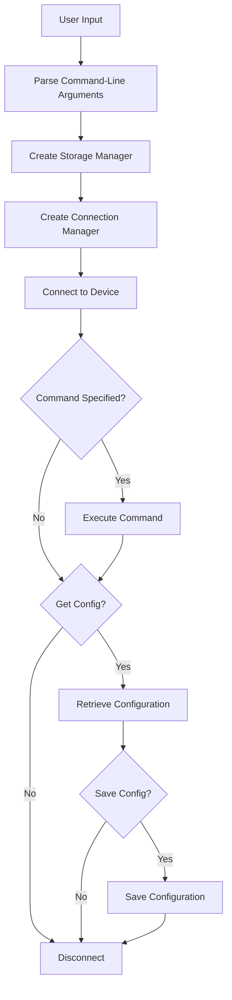
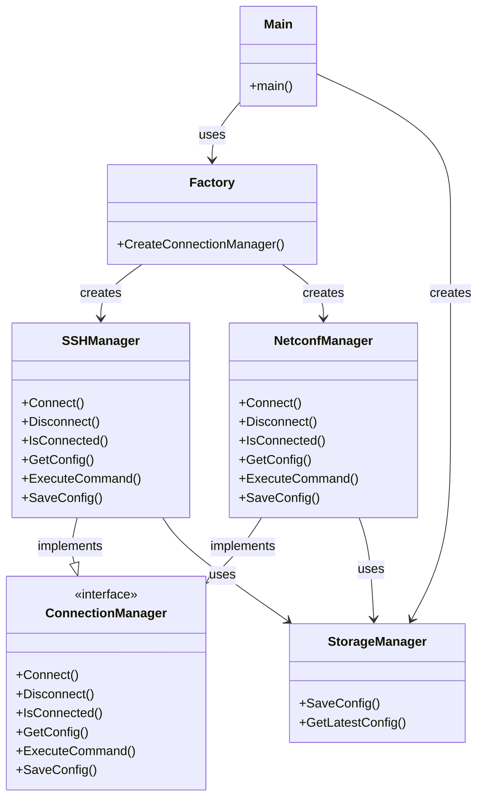

# Shorun

> [!WARNING]
> Shorun is still under development so it is also still in the pre-alpha phase! So do not use it for production purposes.

Shorun is a high-speed, modern tool for backing up network device configurations. The project was started because existing solutions like RANCID and Oxidized were not fast or sufficient for our operational needs. We built Shorun from the ground up to be a capable and efficient replacement.

The name itself is a nod to the ubiquitous Cisco IOS command, show running-config, which is used to display a device's current configuration.

## Flow

Shorun follows a streamlined process for connecting to network devices, executing commands, and managing configurations:



The architecture of Shorun is built around several key components:



## Usage Examples

### Basic Usage

Connect to a device using SSH and retrieve its configuration:

```bash
shorun -host 192.168.1.1 -username admin -password secret -get-config
```

### Connection Types

Connect using SSH (default):

```bash
shorun -host 192.168.1.1 -username admin -password secret -command "show version"
```

Connect using NETCONF:

```bash
shorun -host 192.168.1.1 -port 830 -username admin -password secret -type netconf -get-config
```

### Device Types and Models

Specify device type and model for better compatibility:

```bash
shorun -host 192.168.1.1 -username admin -password secret -device-type cisco -device-model ios -get-config
```

### Executing Commands

Execute a specific command on the device:

```bash
shorun -host 192.168.1.1 -username admin -password secret -command "show interfaces"
```

### Saving Configurations

Save the configuration to a specific file:

```bash
shorun -host 192.168.1.1 -username admin -password secret -get-config -save-config /path/to/config.txt
```

Save configurations to a custom directory:

```bash
shorun -host 192.168.1.1 -username admin -password secret -get-config -config-dir /path/to/configs
```

### Available Options

- `-host`: Host to connect to (required)
- `-port`: Port to connect to (default: 22 for SSH, 830 for NETCONF)
- `-username`: Username for authentication (required)
- `-password`: Password for authentication (required)
- `-type`: Connection type (ssh or netconf, default: ssh)
- `-device-type`: Device type (cisco, juniper, arista, huawei, generic)
- `-device-model`: Device model (ios, ios-xr, nxos, junos, eos, vrp)
- `-command`: Command to execute (optional)
- `-get-config`: Get device configuration
- `-save-config`: Save configuration to file (specify path or leave empty for default)
- `-config-dir`: Directory to store configurations (default: "configs")

